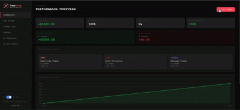
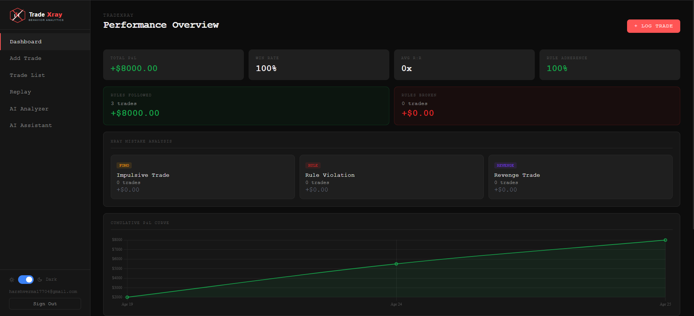
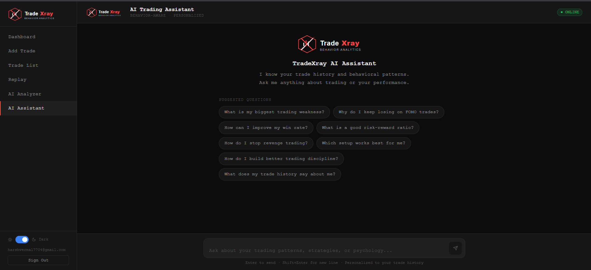

# 🚀 TradeXray

### Behavior-Aware Trading Journal

  <b>Track trades. Analyze behavior. Improve decisions.</b>

  
  
  
  

---

## 🧠 Why TradeXray?

Most trading tools focus on **what happened**.

TradeXray focuses on:

> **why it happened**

Because losses are rarely random.

They come from:

* breaking rules
* emotional decisions
* inconsistent execution

---

## 💡 What It Does

TradeXray helps you:

* 📊 Log trades with context
* 🧠 Track behavior & decisions
* ⚠️ Identify repeated mistakes
* 📉 Analyze performance patterns
* 🤖 Learn with an AI assistant

---

## 🎥 Product Demo

  

---

## 📸 Screenshots

  
    
  
    
  
    
  
  

---

## 🌐 Live App

👉 https://tradexray-frontend.vercel.app/

---

## 🏗️ Tech Overview

| Layer    | Stack             |
| -------- | ----------------- |
| Frontend | Next.js           |
| Backend  | Node.js + Express |
| Database | Supabase          |
| Hosting  | Vercel + Render   |

---

## 🎯 Vision

Trading is not just about strategy.

It’s about:

* discipline
* execution
* consistency

TradeXray is built to make those measurable.

---

## 📌 Note

This is a **showcase repository**.

Core backend logic and services are kept private.

---

## 🤝 Feedback

Looking for early feedback from:

* traders
* builders
* product folks

Feel free to connect or share thoughts.

---

  Built to turn trading mistakes into insights ⚡

